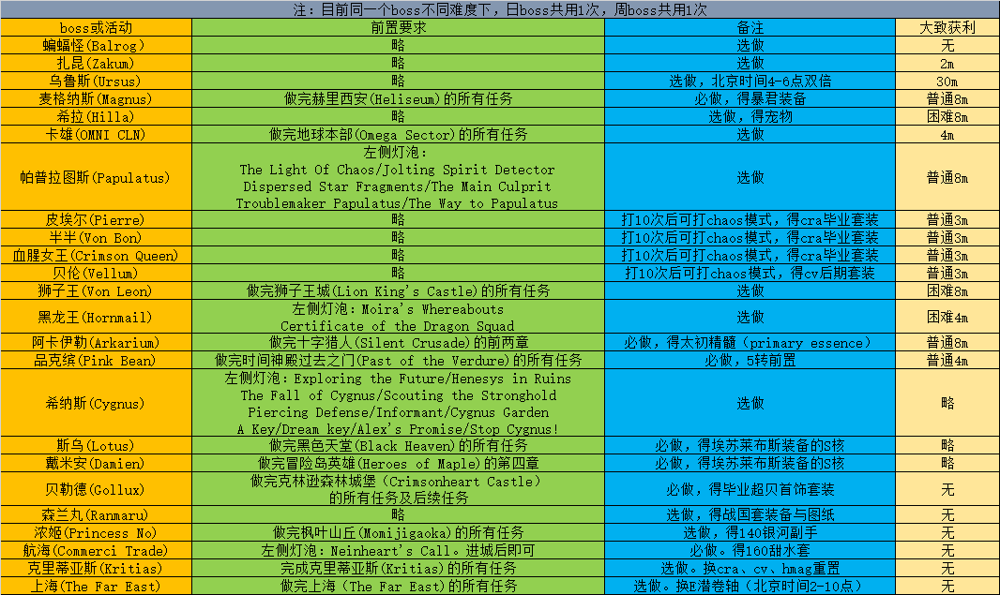

# Boss

## Boss机制

## 威尔技能与机制全讲解
* [P1](https://www.bilibili.com/video/av71558666)
* [P2](https://www.bilibili.com/video/av71558902)
* [威尔P2小游戏 指路 11:45, 13:45, 15:45, 17:45](https://youtu.be/KJ0QOSKXjbo)

* [P3](https://www.bilibili.com/video/av71558994)

## CPAP(C闹钟)
* [CPap图文攻略](https://forum.gamer.com.tw/C.php?bsn=7650&snA=988228)

## 真希拉
* [真希拉机制讲解 VHilla Mechanic Guide](https://forum.gamer.com.tw/C.php?bsn=7650&snA=998758)

## Boss前置

* [Princess No浓姬前置任务攻略](../../files/princeNo.pdf)
* [hmag前置](../../files/Farm_Hmag_prequest_item_by_kanna.docx)
* [闹钟前置](https://www.youtube.com/watch?v=K_MOi0zwteM&t=67s)

* [Cygnus前置](https://forum.gamer.com.tw/C.php?bsn=7650&snA=1010453&tnum=1)

## Boss前置及掉落物
