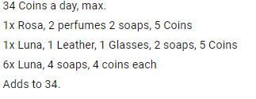
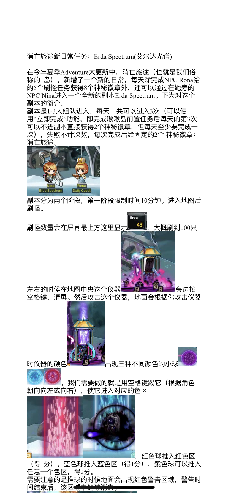
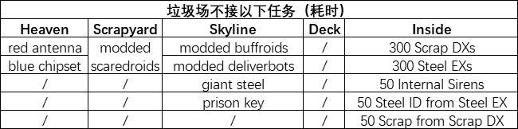

# 副本

## 日常副本

## 航海

### 航海最大金币获取方法

## 神秘河(岛球)日常

### 二岛菜谱

### 一岛新组队任务

## AB周常

* [韩版黑暗天堂每周任务](https://home.gamer.com.tw/creationDetail.php?sn=4332873)
* 机械坟墓周常不推荐任务
    * 

## 跑旗

### 跑旗4am PST | 7am EST 小技巧
1. 最好有防滑鞋，边缘起跳，下凹三角形过左边缘瞬间起跳，上凸三角形过最高点后起跳
2. 右上角跳到booster上后不要按任何方向键，按住跳不放，即可弹射2连跳到左边大炮后的平台
3. 第二圈开始右下角的阶梯处，可以左跳到平台上接S技能，起跳在空中按S 和 ↑ 即可通过传送口到上方平台
4. 如果有D技能，则可在左中上booster处，加速的瞬间按D，即可冲过
* 参考视频
   * [BiliBili](https://www.bilibili.com/video/av52681850/)
   * [Youtube](https://youtu.be/_i0rJWNjc4I)


## 起源塔

* [起源之塔攻略](https://dexless.com/guides/tower-of-oz-comprehensive-guide.145/)
* [OZ塔22层图解攻略及下路走法视频](https://forum.gamer.com.tw/C.php?bsn=7650&snA=918980)
* [起源之塔43F答题记录表（Oz Tower 43F form）](https://xnum.github.io/MStoweroz/43.html)

## 其他副本

### 结婚小镇
* [Amoria结婚小镇苹果组队任务APQ攻略(10分钟内+100攻击力BUFF)](../../files/applepg.pdf)

### Phantom Forest wanted daily(银币)
* Caught in the Storm----- Corrupted Stormcaster（推荐）
* The Lost Shadow---- Corrupted Shadowknight (推荐）
* Blind Flame---- Corrupted Flamekeeper
* Broken Arrow---- Corrupted Windreaver
* A Sword of Heartbreak---- Corrupted Master
* Dust to Dust---- Elderwraith
* Ashes to Ashes---- Krakian Spirit
* Logging Work---- Phantom Tree

## 活动副本

## 解救拟真机器人攻略(Wondroid)
* [视频参考一](https://b23.tv/av17364878/p1)
* [视频参考二](https://b23.tv/av10533849/p1)