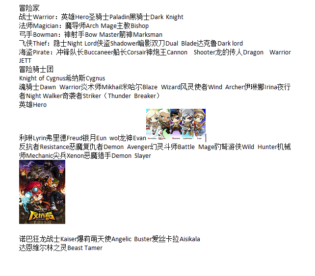

# 职业相关

* [全職業Optimal 內淺（After glory）](https://maplestory.aldu.tv/maplestory-inner-ability/)
* [各职业无敌or保命技能&bind技能列表](https://www.reddit.com/r/Maplestory/comments/8puqcu/cataloging_info_on_each_classs_iframe_bind_skills/?utm_source=share&utm_medium=web2x)

## 职业名称翻译

## 林之灵加点方案推荐
1. bt存在bug可能可以吃到4系的被动效果。 举例来说：
    林之灵无论加不加豹子技能，打BOSS时候显示的单排和BA并没有差异，
    但加豹子的林之灵实际给BOSS造成的伤害，会比没加豹子的林之灵高得多，但猫和鹰好像不明显。
2. bt常态20%真减伤，无敌技能的cd很短
3. Mana Overload对熊形态平A加成很大
4. 33k bt居然道场49层……感觉受到了莫大的伤害
5. [参考视频](https://www.bilibili.com/read/cv3581621)

## 当前版本职业选择推荐
* [原始版](https://b23.tv/av88795326/p1)
* [量化评级](https://www.bilibili.com/video/BV1AZ4y1x7CE/)