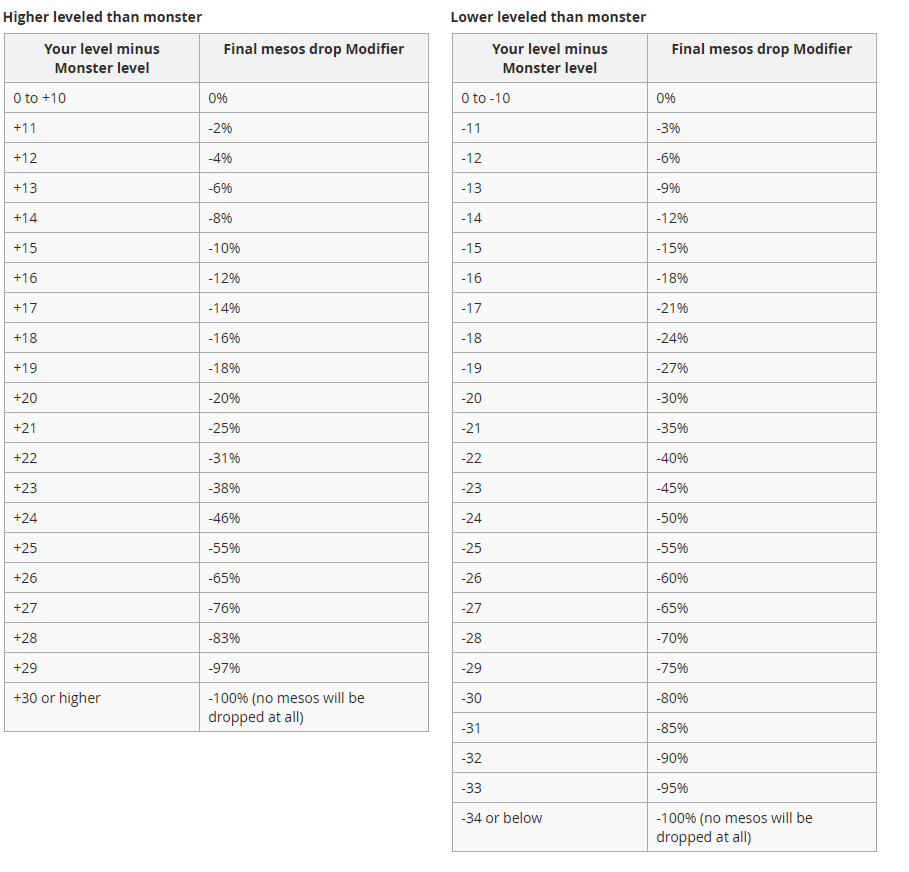
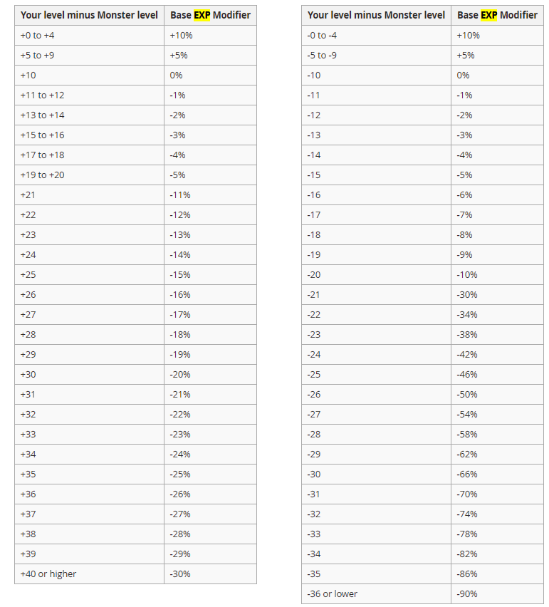
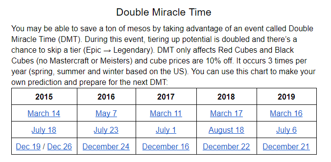

# Maplestory游戏机制

## 基础知识
* [REBOOT区扫盲文件](../../files/REBOOT.docx)
* [伤害倍化类型及作用方式](../../files/multipledmg.docx)
* [R区ATT与BOSS伤如何选择](../../files/RATTBOSS.docx)
* [全职业武器系数整理](../../files/weaponrate.txt)
* [对怪物收藏感兴趣的 可以看看这篇帖子](http://tieba.baidu.com/p/6076597111?share=9105&fr=share&unique=5B252F2240B2F8079F926D761AFA9E73&st=1573663652&client_type=1&client_version=10.3.16&sfc=copy)
* [怪物密度查询](https://maplestory.wiki/GMS/210.1.1/map)

### 各等级影响怪物meso掉落比率

### 各等级影响怪物经验获得比率

## 历届dmt
