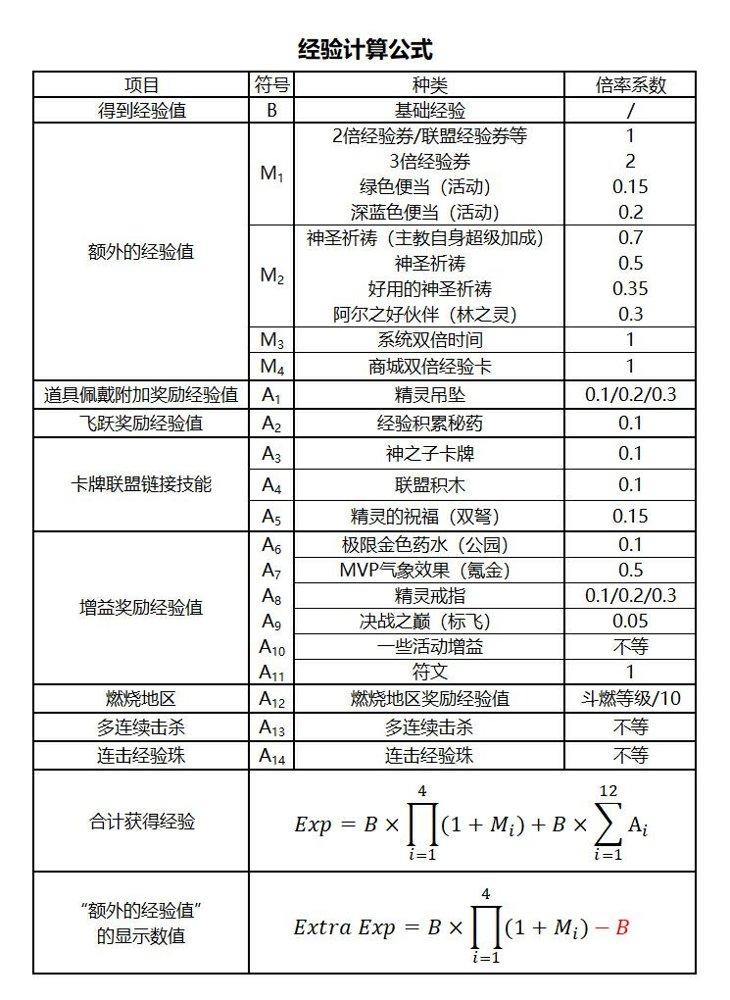

# 工具及计算器

## 角色强度
* [MapleStory Calculators](https://docs.google.com/spreadsheets/d/1gi3Ax6bUN4FHeQ43vG0gwMIv7os1nFXhu4ygcwFnM2k/edit#gid=1171531059)
* 此计算器持续更新，点击表格内的链接跳转到最新版本的计算器
* **cr. to 鲁々**

## 上星计算器
* [上星计算器链接](https://amph.shinyapps.io/starforce/)
* 注意！第一项选择 GMS Adventure 25*
* **cr. to 鲁々**

## Legion模拟器
* [Legion模拟器链接](https://xenogents.github.io/LegionSolver/)
* 准备工作: 在左侧填入当前自己账号中的职业等级分布，并在中间的Synergy Grid中点选需要覆盖的区域。
* TIPS: 勾选右下方"Region"按钮可直接选中整个由粗线框中的区域。
* 填好后点击"Start"，程序就会自动尝试利用你填写的职业等级分布来拼满你在中间的Synergy Grid里所选的区域。
* **cr. to 恩荣**

## 日常清单、岛球计算器
* [日常清单](../../files/MS_daily.xlsm)
* [岛球计算器( acrane symbol calculator)]( https://maplestory.aldu.tv/arcane-symbol-calculator/)

## 经验计算公式

## 积分计算器 reward point optimizer
[reward point optimizer](https://docs.google.com/spreadsheets/d/1Y1zpqTDhCcbyOQ9-vKs9MLQ9i1vVb9aeHbcSHZkubGY/edit)

**使用指南**


## 放大镜程序
* [程序链接](https://hiperv.tistory.com/230)
* 推荐一个放大镜程序，该程序可将您想要放大的屏幕放大和缩小到所需的大小并在所需的区域显示它。可以多次执行多个放大镜屏幕，并无缝传输原始屏幕。（免费版几分钟会断一次）（软件全韩文，靠google翻译网页和youtube字幕翻译勉强用）
