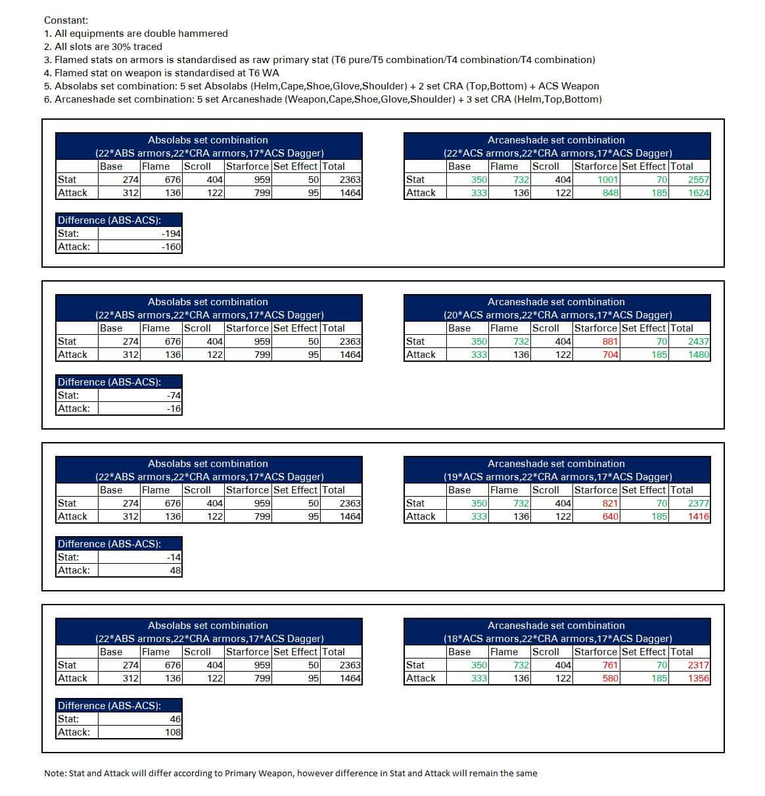
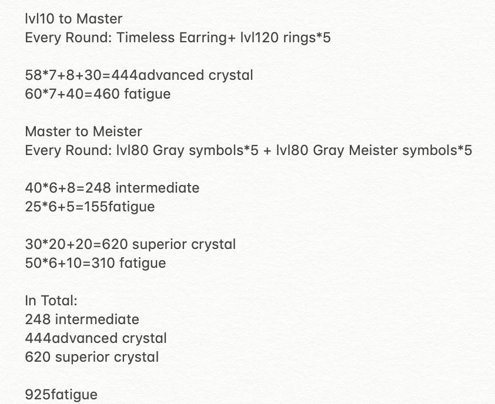
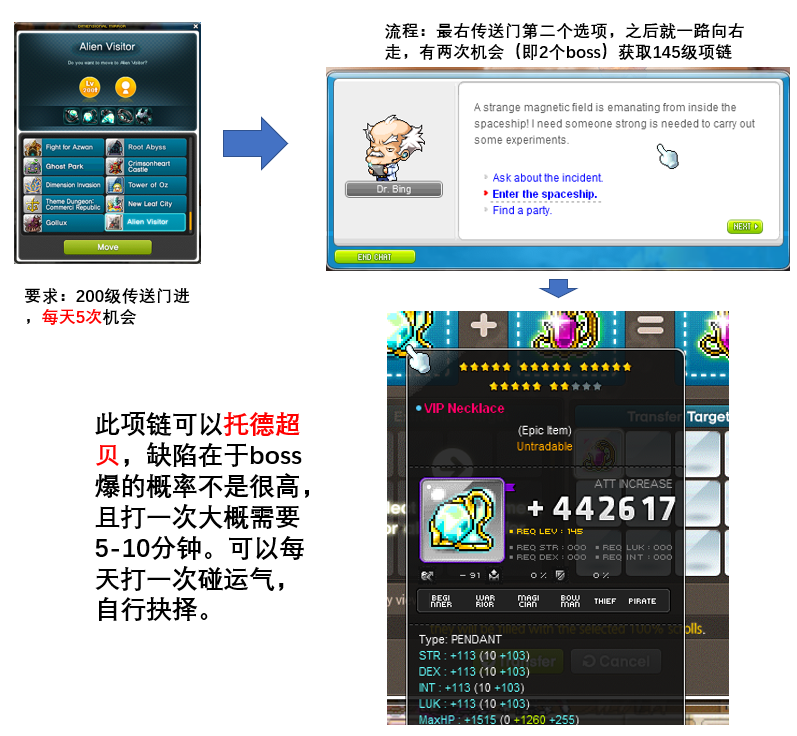
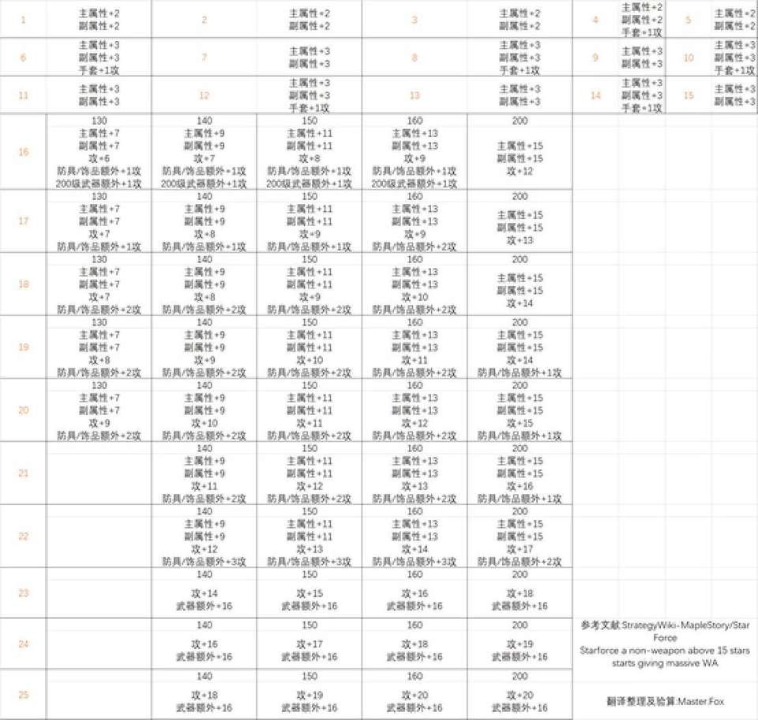

# 装备选择及强化

## 装备选择

* 25星裝備與首飾推薦路線

* [各种永久title数据对比](https://mxdmf.com/thread-538.htm)
* [Comparison between arcare and absolab](https://docs.google.com/spreadsheets/d/1GKmDGh6bXgMm0mBTryFhadoqFLKB_SDgNUDjUlcthdY/edit#gid=2123594025)

## Arcane Umbra 对比 AbsoLab 真四火花修正版

## 装备获取

* [首飾巨匠小攻略](https://docs.google.com/document/d/1eHtEHZiAPYhRJLx5nEnIfILK0AbPQGsLGZIPy60JYyU/edit)
* [超甜耳环制作攻略](../../files/chaotianerhuan.pdf)
* [Commerci攻略 - 航海甜水托德](../../files/Commerci_-_.docx)
* [ss ring合成](../../files/SS_Ring.docx)

## 首饰制作10级到Meister所需要的材料&疲劳值

## 除统治者吊坠外的托德材料

## familiar（怪怪卡）的合成培养

### 背景介绍
* familiar系统介绍

* [各tier属性](https://docs.google.com/spreadsheets/d/15ie-4V0hO_RMs7BH1ObM00Z5iZnhFCD8h1iZI9IuUCo/edit#gid=0)
* [光头整理的 badge详细列表 Pocketstream Badge List](https://docs.google.com/spreadsheets/d/1HShIqsK0zghH6BnrFgJJnrxOXcauHbGpgX8gL310NNQ/edit#gid=0)

### 总结攻略
* [怪怪卡获得及提升](../../files/guaiguaika.txt)

## 装备上星、火花及潜能

* [各种魔方几率](https://mxdmf.com/thread-539.htm)
* [装备潜能Drop Rate Cap:300%, 其他东西无上限](https://www.reddit.com/r/Maplestory/comments/66mzqo/nexons_response_to_drop_rate_changes_in_kms_v/)
* [装备火花期望值（Equip Flame Expectation）](../../files/equipflame.txt)

## 每星所加属性
