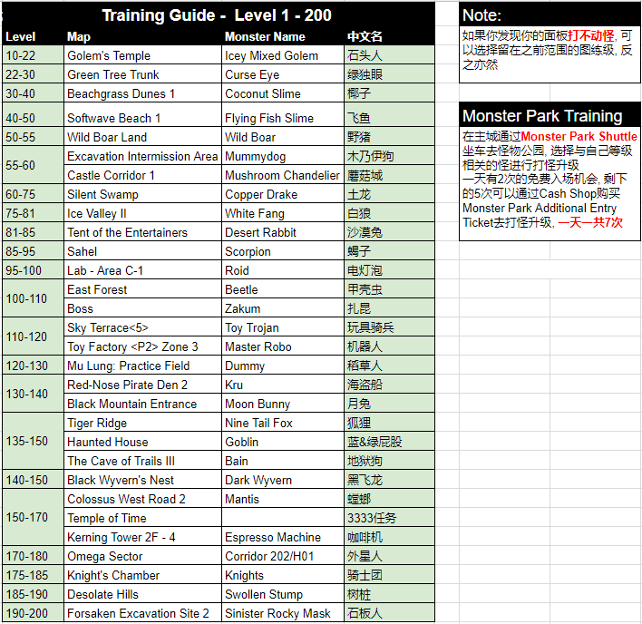
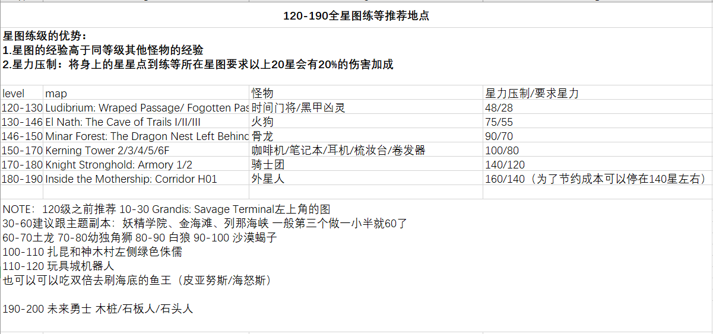
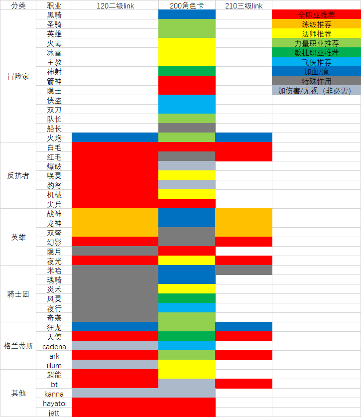

# Link & legion

## 小号培养
* [如何快速高效地练Legion&Link](../../files/Link_Legion.pdf)
* [美服攻略（练级顺序）1.1.2](../../files/1.1.2.pdf)

## 1-200练级地点推荐

## 120-190 全星图练等推荐地点
**170-180骑士团怪物数量少，平台间隔大，建议去外星人普通图打**

## link及legion选择

* [Legion枫叶联合系统(改版角色卡)资讯简介](../../files/legionxiangjie.pdf)
* [美服攻略（模块分类）3.0.1](../../files/3.0.1.pdf)
* [简明legion BT加点](https://www.reddit.com/r/Maplestory/comments/chl55r/a_guide_to_the_newly_buffed_beast_tamer_class/)
* [Jett link技能介绍， 包含如何洗， 转动的规律等](https://www.bilibili.com/video/BV1St411D7fB?from=search&seid=14020173280875980909)
* [Legion & Link列表 (已更新Zero和Adele，按优先级排序)](https://docs.google.com/spreadsheets/d/1A5V3rfBvmuseP32r40PKxf66KYNVsF-pjE3vs9SfnKM/edit?usp=sharing)

## link与角色卡推荐内容
