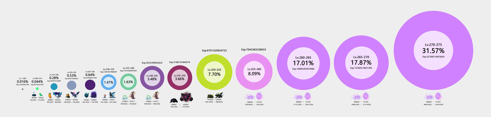

# 主号练级/刷钱/Node

## 升级与NODE

* [V技能和三合一技能需要多少经验升级](https://forum.gamer.com.tw/C.php?bsn=7650&snA=963244)
* [台风升级药水超过等级对应经验](https://forum.gamer.com.tw/C.php?bsn=7650&snA=1004024&tnum=1)

### 各阶段等级需要经验总量及对应怪物只数

## Kanna刷钱及挂鬼

### kanna revamp review_GMS
* [文字版](https://docs.google.com/document/d/1oyJSU3EUaJ4HPlG7IcGogHTc-0Iju2rw5XCXi2fIoK8/mobilebasic)
* 视频


### 两种独立Kanna挂鬼神方式
    
* 压spanish/sticky key 打拳+鬼神，需要手动离开墙角
* spanish/sticky key 打拳+瞬移，需要手动放鬼 不怕卡角落

### 鬼神改版后刷图手法
* [Side Path](https://www.youtube.com/watch?v=PMhN3tulrR0)

* [DCUP1](https://youtu.be/ZiC7wVmJC1Q)

* [MTS7](https://youtu.be/fe9WIwJJBLI)

* [Outlaw2 有魂刷法（转自b站）](https://www.bilibili.com/video/BV1rk4y1m7pd/)

## 其他farm

* [每日每周BOSS水晶收入表](https://docs.google.com/spreadsheets/d/1LcNX1TOHV1sCAp5jp2WaG9uYb9UbzJO35wLbhXwCYxw/edit#gid=128027786)

### 7个最佳卖水晶配比(日boss)

收入一共4700万
* h狮子  
* n阿卡 
* n品客斌  
* n麦 
* hard森兰丸 
* chaos黑龙  
* n闹钟

### 挖矿地图推荐地点
    
* Korean Folk Town: Goblin House
* Kerning Tower 2F Cafe<4>
* Inside the Mothership : Corridor 202 203 204
* Longest Ride on ByeByeStation
* 2岛以后的热门刷钱地图